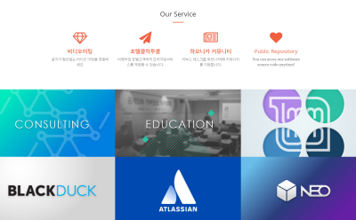

# 프로젝트명
> invesume team repository offcial website

인베슘에서 운영하는 공개저장소를 소개하는 웹사이트 입니다.

웹브라우저에서 아래의 주소로 접근가능합니다.

url : http://oss.invesume.com

## 업데이트 내역

* 0.2.0
    * 리뉴얼 디자인 작업 반영
* 0.1.1
    * 메인 이미지 추가
* 0.1.0
    * 첫 사이트 배포 

## Developer

김형채 – [@chaeya 주소](https://twitter.com/chaeya) – hckim@invesume.com

## 기여 방법

1. (<https://github.com/yourname/yourproject/fork>)을 포크합니다.
2. (`git checkout -b feature/fooBar`) 명령어로 새 브랜치를 만드세요.
3. (`git commit -am 'Add some fooBar'`) 명령어로 커밋하세요.
4. (`git push origin feature/fooBar`) 명령어로 브랜치에 푸시하세요. 
5. 풀리퀘스트를 보내주세요.
